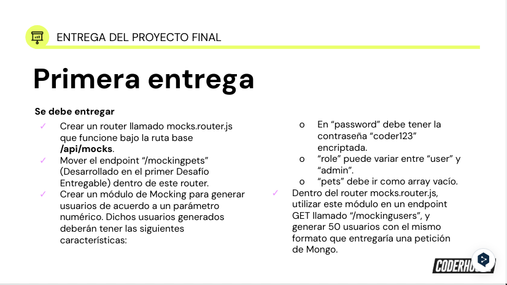
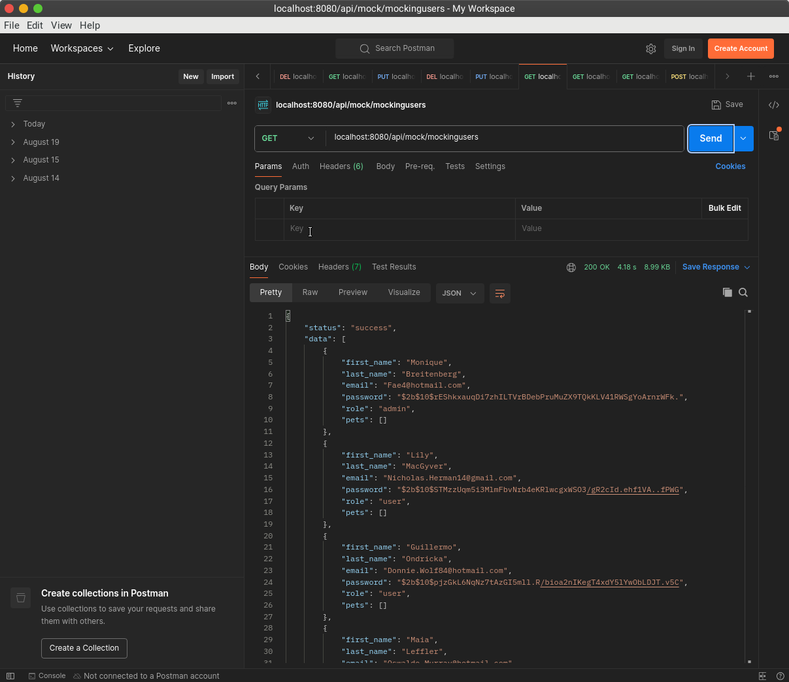
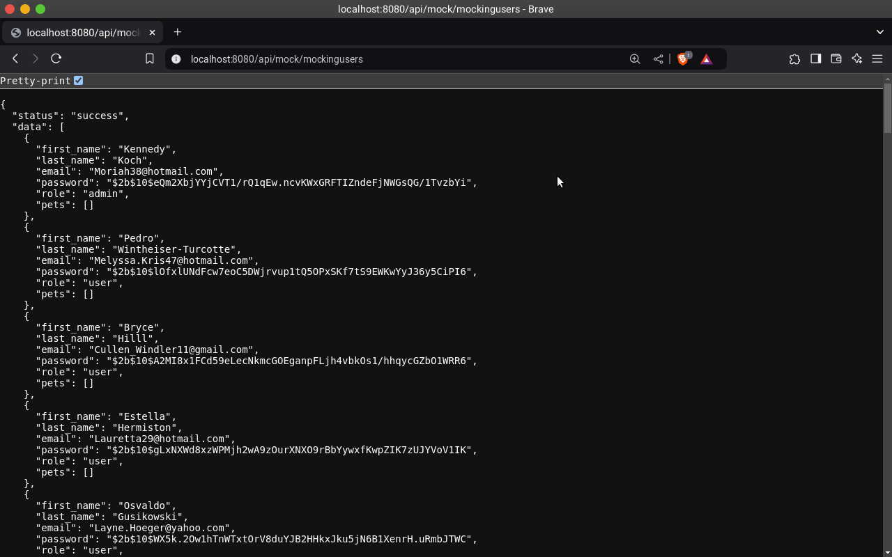
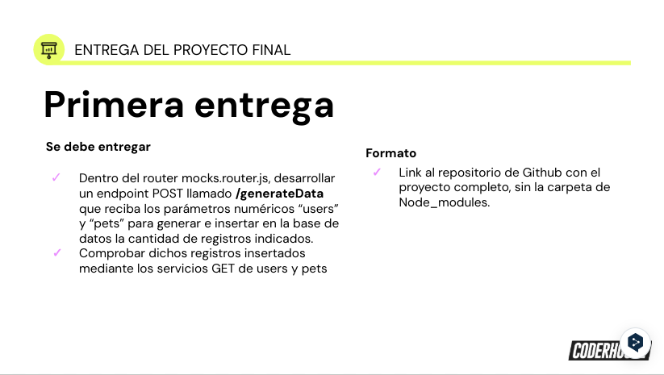
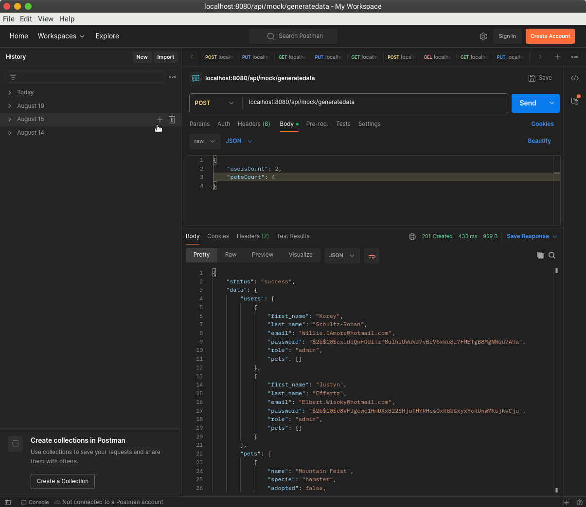
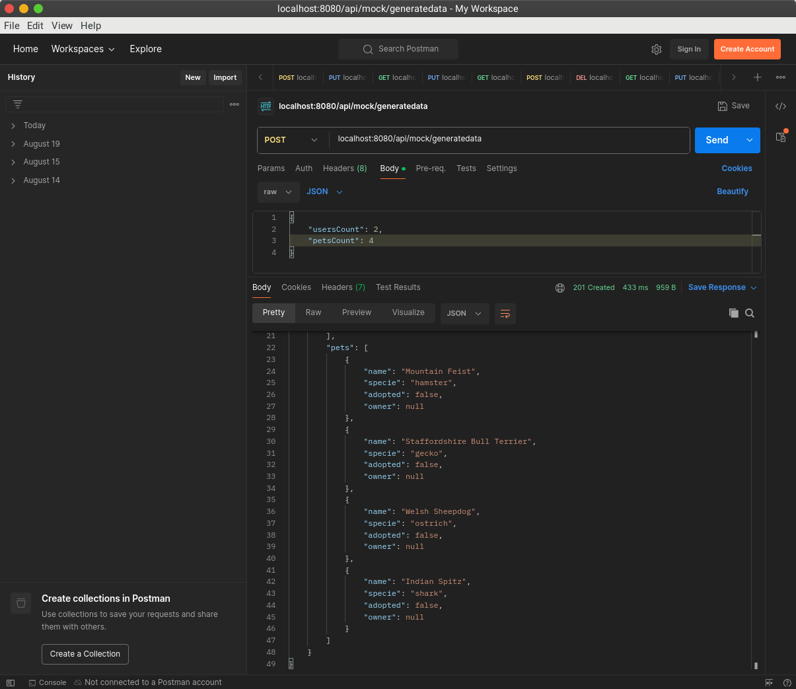
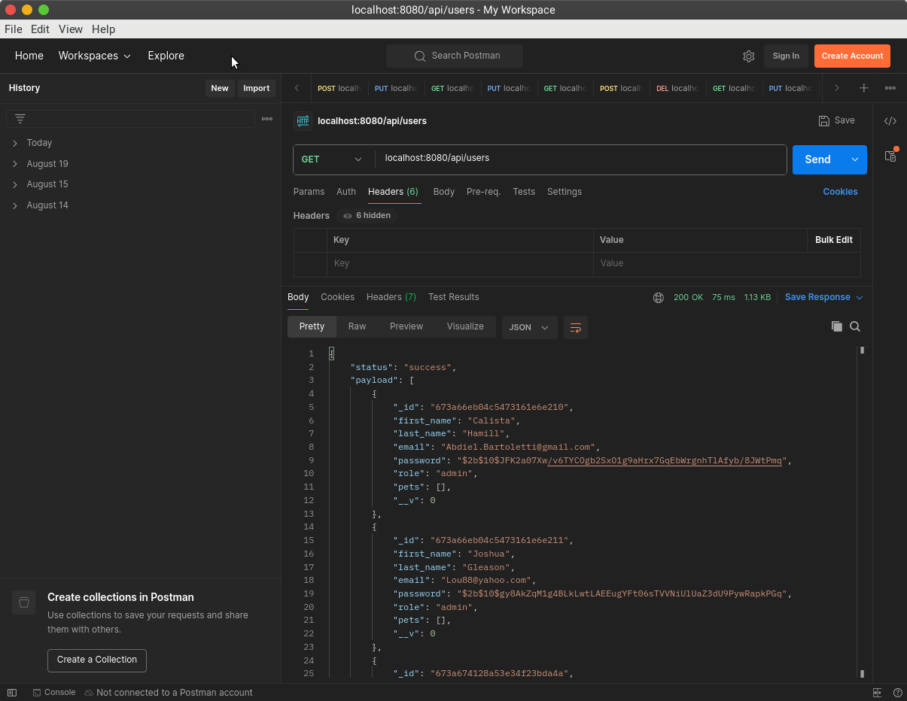
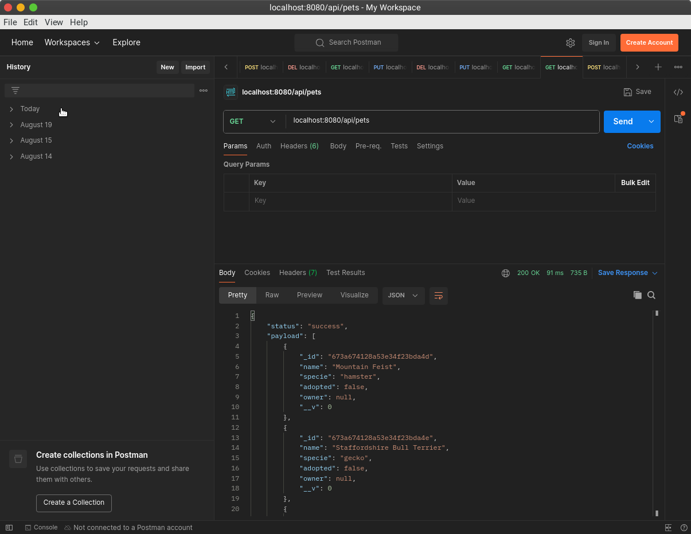

# Backend_III_PreEntrega_01

<div align="center" id="top"> 
  

&#xa0;

  <!-- <a href="https://backend_70075.netlify.app">Demo</a> -->
</div>
<!-- 
<h1 align="center">1era Pre-entrega - Backend_70075</h1>

<p align="center">
  

  

  

  
 -->
  <!--  -->

  <!--  -->

  <!--  -->
</p>

<!-- Status -->

<h4 align="center">
	  Backend_70075 🚀 Pre-Entrega Proyecto Final Backend Avanzado III.  
</h4>

<br>

## Primera Pre-Entrega Proyecto Final

Test y Mocks.

Creación de Mocks, generación de datos con faker y cargar a la base de datos.

Se cumplieron los requerimientos según las siguientes consignas:

  <br>




### Generación de 50 usuarios con endpoint GET.

[localhost:8080/api/mock/mockingusers](http://localhost:8080/api/mock/mockingusers)



<br>



<br>



### Desarrollo de endpoint /generatedata y comprobación mediante servicios GET de users y pets.

Se desarrollo endpoint POST llamado '/generatedata' que recibe parámetros numéricos "users" y "pets" (cambiados por userCount y petsCount) para generar e insertar en la base de datos.

[localhost:8080/api/mock/generatedata](http://localhost:8080/api/mock/generatedata)

#### Generación y carga de datos a la base de datos:


<br>


#### Comprobación Registros Insertados:


<br>


### Organización: Estructura de Archivos

    BACKEND_70075-root/

```
└── 📁src
    └── 📁controllers
        └── adoptions.controller.js
        └── mocking.controller.js
        └── pets.controller.js
        └── sessions.controller.js
        └── users.controller.js
    └── 📁dao
        └── 📁models
            └── Adoption.js
            └── Pet.js
            └── User.js
        └── Adoption.js
        └── Pets.dao.js
        └── Users.dao.js
    └── 📁dto
        └── Pet.dto.js
        └── User.dto.js
    └── 📁mocking
        └── pets.mock.js
        └── users.mock.js
    └── 📁public
        └── 📁img
            └── 1671549990926-coderDog.jpg
            └── avatar.png
            └── Snapshot_get_pets.png
            └── Snapshot_get_users.png
            └── Snapshot_post_users_pets_01.png
            └── Snapshot_post_users_pets_02.png
            └── Snapshot_preentregaIII_1.png
            └── Snapshot_preentregaIII_2.png
            └── Snapshot_preentregaIII_3.png
    └── 📁repository
        └── AdoptionRepository.js
        └── GenericRepository.js
        └── PetRepository.js
        └── UserRepository.js
    └── 📁routes
        └── adoption.router.js
        └── mocks.router.js
        └── pets.router.js
        └── sessions.router.js
        └── users.router.js
    └── 📁services
        └── index.js
    └── 📁utils
        └── error.dictionary.js
        └── error.helper.js
        └── error.utils.js
        └── index.js
        └── uploader.js
    └── app.js
```

## Iniciando

```bash
# Clonar este proyecto
$ git clone https://github.com/Joamilibar/Backend_III_PreEnt.git

# Instalar dependencias
$ npm install

# Iniciar servidor
$ npm start

# El servidor inicia en: <http://localhost:8080>
```

## License

#### Pública

<!-- This project is under license from MIT. For more details, see the [LICENSE](LICENSE.md) file. -->

by <a href="https://github.com/Joamilibar/Backend_III_PreEnt.git" target="_blank">`Joamil Ibarra`</a>

&#xa0;

<a href="#top">Back to top</a>
# backend_III_Final
# backend_III_Final
# backend_III_Final
